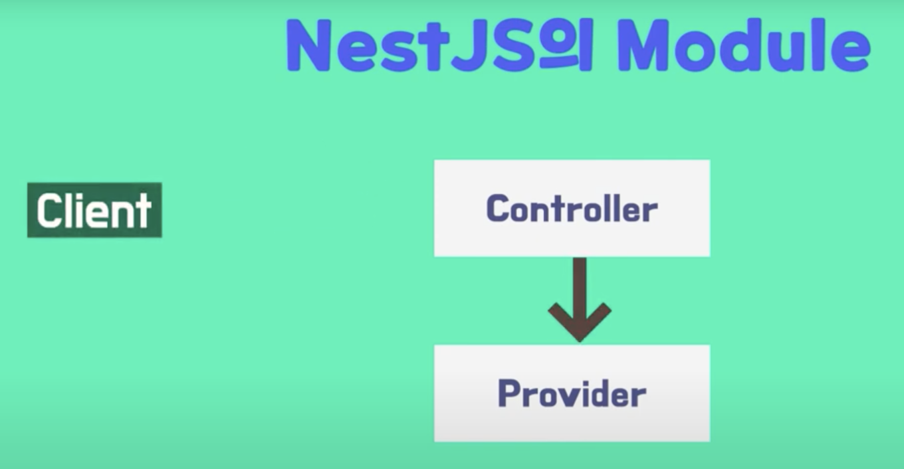

## Controller
Controller는 Client의 request(요청)를 받아 처리한 후 reponse(응답)하는 역할을 한다.



Client의 요청이 들어왔을 때 요청에 따라 처리할 Controller로 분기처리하는 것을 Routing 이라고 한다.

@Controller() 데코레이터를 사용하여 ()안에 요청 라우팅 path를 지정할 수 있으며 
HTTP Request Method (@Get, @Post, @Put, @Delete) 데코레이터를 사용할 수 있다.

```javascript 
import { Controller } from '@nestjs/common';

@Controller('cats')
export class CatsController {
    @Get()
    findAll(): string {
        return "This action returns all cats';
    }
}
```

위의 @Get() 데코레이터는 Controller의 라우팅 패스를 상속 받기 때문에 Client에서는 다음과 같이 요청할 수 있다.

```http://localhost:3000/cats```

@Get() 데코레이터 @Controller와 마찬가지로 routing path를 지정할 수 있다.

```javascript 
@Get("profile)
```

이 경우 사용자의 요청 URL은 다음과 같다.
```http://localhost:3000/cat/prifile```
___

### Request 객체
NestJS는 Express를 사용하고 있으므로 Request 객체를 사용할 수 있다.
Request 객체는 HTTP method, URL, Headers 등의 요청정보를 받아오며 핸들러 parameter에 @Req() 데코레이터를 사용한다.

```javascript 
import { Controller, Get, Req } from '@nestjs/common';
import { Request } from 'express';

@Controller('cats')
export class CatsController {
    @Get()
    findAll(@Req() request: Request): string {
        console.log(request);
        return "This action returns all cats';
    }
}
```

### Route parameters
클라이언트이 요청으로 경로 파라미터를 처리하기 위해 사용된다. 경로 파라미터는 URL의 경로의 일부로 전달되는 동적 값을 의미하며, 이를 통해 특정 리소스나 데이터를 식별하거나 처리할 때 사용한다. 

```javascript
    @Get(:Id)
    findOne(@Param() params): string {
        console.log(params.id);
        return "This action returns a #${params.id} cat';
    }
```

만약 id가 1일 경우 호출 url은 다음과 같다.
```http://localhost:3000/cat/1```
___

### @Req(), @Param()
@Req(), @Param()는 클라이언트 요청 데이터 처리할 때 사용하며 둘 다 경로 파라미터 추출 가능. 
하지만 @Req()는 요청 전체를 처리하는 범용 도구라서 헤더, 본문, 쿼리 등 다양한 데이터 다룰 때 적합한 반면 @Param()은 경로 파라미터만 처리하도록 설계되었기 때문에 경로 파라미터만 필요하면 @Param() 쓰는 게 더 효율적이다.

### 비동기 처리
비동기 처리는 코드가 실행되는 동안 특정 작업(API 요청 및 DB 데이터 요청)이 완료 될 때까지 기다리지 않고,
다음 작업을 계속 진행할 수 있도록 하는 방식을 말한다.

비동기 함수는 즉시 결과를 반환하지 않고, 시간이 걸리는 작업이 완료된 후에 제공하는 것이 목표로 하는, 나중에 작업이 완료 되었을 때 결과를 받을 수 있는 표준화된 방식이 필요한데 이 역할을 하는 것이 Promise(객체)이다.

```javascript
const fetchData = () => {
  fetch('https://jsonplaceholder.typicode.com/todos/1') // 비동기 요청
    .then((response) => {
      if (!response.ok) {
        throw new Error('Network response was not ok');
      }
      return response.json(); // JSON으로 변환
    })
    .then((data) => {
      console.log(data); // 데이터를 출력
    })
    .catch((error) => {
      console.error('Error:', error); // 에러 처리
    });
};

fetchData();
```

비동기 작업을 할 때 작업을 더 간결하고 직관적으로 작성하기 위해 Async/Await를 사용할 수 한다.
___
### 비동기 Async/Await 사용
```javascript
    const fetchData = async () => {
  try {
    const response = await fetch('https://jsonplaceholder.typicode.com/todos/1');
    const data = await response.json();
    console.log(data); // 데이터를 출력
  } catch (error) {
    console.error('Error:', error); // 에러 처리
  }
};
fetchData();
```
이전 코드 처럼 Promise체인(.then)을 사용해도 크게 문제는 없지만 .then() 체인이 길어질 경우 코드가
복잡해져 유지보수가 어려워진다. 하여 Async/Await을 사용하여 비동기 작업을 동기적 코드의 형태로 작성할 수
있도록 해주기 때문에 복잡한 .then() 체인을 제거하여 유지보수성을 높일 수 있다.

### API
RESTful API의 기본적인 CRUD(Create, Read, create, update, remove)동작을 구현할 때 사용하는 
표준적 엔드포인트 이름이 있다.

- findAll : 전체 데이터 목록 조회
- findOne : 데이터 상세 조회
- create : 데이터 생성
- update : 데이터 수정
- remove : 데이터 삭제 

```javascript
import { Body, Controller, Delete, Get, Param, Post, Put } from '@nestjs/common';
import { CreateUserDto } from './CreateUsersDto';

@Controller('users')
export class UsersController {
    @Get() //user
    findAll():string{
        return 'This action returns all users';
    }

    @Get(':id')
    findOne(@Param('id')id : string) : string{
        return `This action returns a #${id} users`
    }

    @Post()
    create(@Body() CreateUserDto: CreateUserDto): string{
        return `This action adds a new users 
        Name: ${CreateUserDto.address}
        Password: ${CreateUserDto.email}
        Email: ${CreateUserDto.gender}
        Gender: ${CreateUserDto.name}
        Address: ${CreateUserDto.password}`; 
    }

    @Put(':id')
    update(@Param('id')id: string, @Body() CreateUserDto: CreateUserDto){
        return `This action update a #${id} users`;
    }

    @Delete(':id')
    remove(@Param('id')id: string){
        return `This action removes a #${id} users`
    }
}
```


@Body를 통해 데이터를 처리하기 위해선 key & value 형식으로 전달해야 하기 때문에 Json 형식 및 x-www-form-urlencoded 형식으로 데이터를 전달한다.


