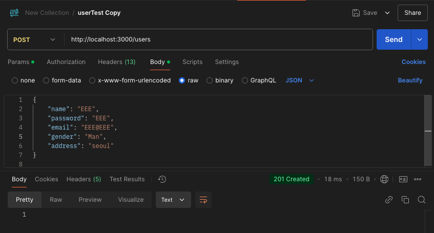
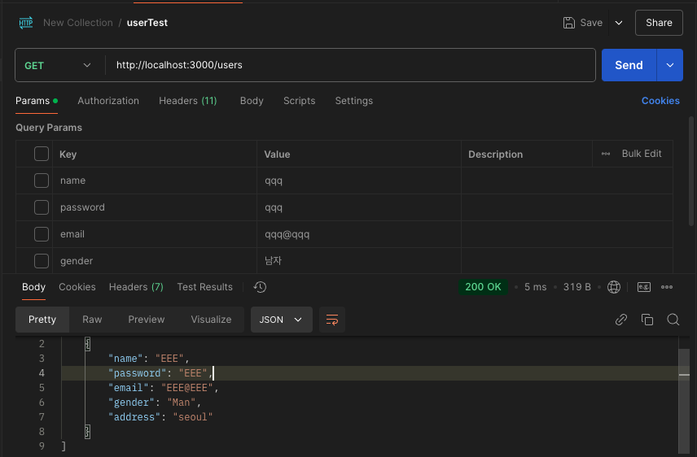
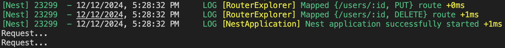

## Nest 미들웨어
미들웨어는 라우터 핸들러 이전에 호출되는 함수이다.

Middleware는 클라이언트 요청(Request)이 라우터 핸들러(Controller의 Method)에 도달하기 전에 요청을 가로채어 추가 작업을 수행할 수 있는 기능을 제공한다. 이를 통해 공통적으로 처리해야 하는 로직을 한 곳에 모아 코드의 중복을 방지하고, 재사용 가능한 코드를 작성할 수 있다.


Middleware로 클라이언트의 요청을 라우터 Router Handler가 받기 전에 공통적으로 처리해야 하는 부분(인증, 로깅, 검증)들의 처리를 중복 없이 개발할 수 있다.
___

## 미들웨어 사용
- @Injectalbe 데코레이터 사용
- NestMiddleware 인터페이스를 implements 해서 사용한다.
- Module의 class 내부에 configure를 사용하여 선언하며 이때 NestModule 인터페이스를 implements
한다.

### Logger.middleware.ts
```javascript
import { Injectable, NestMiddleware } from "@nestjs/common";
import { NextFunction } from "express";

@Injectable()
export class LoggerMiddleware implements NestMiddleware{
    //use 메서드
    use(req: Request, res: Response, next: NextFunction) { // 요청, // 응답, // 다음 
      console.log('Request...');
      next(); // next()를 호출하면 요청 흐름이 다음 미들웨어나 라우트 핸들러(컨트롤러)로 넘어간다.
    }
}
```
LoggerMiddleware는 NestJS에서 클라이언트의 요청을(Request)을 가로채어 컨트롤러에 도달하기 전 
log를 출력 한다.

LoggerMiddleware는 NestMiddleware를 상속받아 NestJS 미들웨어로 동작하며
use 메서드는 미들웨어의 진입점으로 요쳥(req), 응답(res), 다음단계(next)를 받는다.

next() 함수를 호출하면 다음 미들웨어나 라우터 핸들러(컨트롤러)로 넘어간다.
___
### app.module.ts
```javascript
import { MiddlewareConsumer, Module, NestModule } from '@nestjs/common';
import { AppController } from './app.controller';
import { AppService } from './app.service';
import { UsersModule } from './users/users.module';
import { LoggerMiddleware } from './users/logger.middleware';

@Module({
  imports: [UsersModule],
  controllers: [AppController],
  providers: [AppService],
})
//user 라우터를 받을 때 독장
export class AppModule implements NestModule{ // configure 메서드를 사용하기 위함 
  //configure 메서드를 통해 미들웨어 설정
  configure(consumer: MiddlewareConsumer) { // MiddlewareConsumer : 미들웨어 설정 객체 
    consumer.apply(LoggerMiddleware).forRoutes('users')
    // apply : 특정 미들웨어 적용
    // forRoutes() : 미들웨어 작동 경로 설정
    // cxclude() : 특정 라우터 제외  
  }
}
```
App.Module.ts는 NestJS 애플리케이션의 루트 모듈로, LoggerMiddleware를 특정 경로(users)에 적용하도록 설정하여 클라이언트가 users 경로로 요청을 보낼 때마다 LoggerMiddleware 에서 요청이 로깅된다.





___
### 미들웨어 여러개 사용가능
```javascript
consumer.apply(cors(), helmet(), logger).forRoutes(UserController);
```

### Global (application 전체 영향)
모든 경로에서 사용하는 미들웨어는 INestApplication 인스턴스에서 제공하는 user() 메서드를 사용할 수 있다.

```javascript
const app = await NestFactory.create(AppModule);
app.use(logger); // application 전체에서 use를 사용하도록 설정 
await app.listen(3000);
```

하지만 Global 미들웨어에서 DI 컨테이너에 엑세스 할 수 없다. (class로 선언된 미들웨어를 사용할 수 없다.)
app.use()에서 미들웨어를 사용할 때는 대신 functional middleware를 사용하고 있다.

