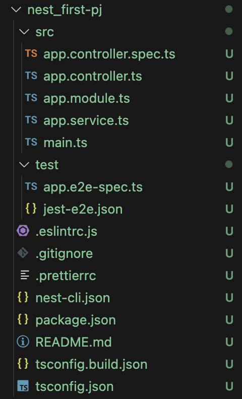
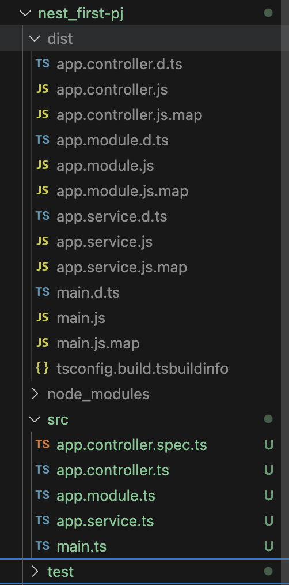
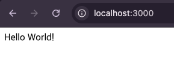

## NestJS 탄생 배경
NodeJS로 인해 javascript를 이용한 클라이언트 + 서버 (풀스택) 개발이 활발해져
javascript라는 한가지 언어로 개발을 할 수 있어 생산성을 향상 시키고 빠른개발이 가능해졌다.

하지만 NodeJS의 높은 자유도로 인해 Architecture 구성이 어렵고 효과적이지 못하였다.
하여 이를 해결하기 위해 Angular의 아키텍처 사상을 기반으로 NestJS가 만들어졌다.

### Angular 아키텍처 사상
- 의존성 주입(DI): 객체 간 결합도를 낮추고 테스트 용이성을 높이는 설계.
- 모듈화(Modular Architecture): 기능별로 분리된 모듈 구조로 개발.
- 컴포넌트 기반 설계: UI를 재사용 가능한 작은 단위로 분리.
- 데코레이터 활용: 선언적 프로그래밍으로 코드 가독성과 생산성 향상.
- MV 패턴*: 관심사의 분리를 통한 코드 관리 용이성.

## NestJS 특징
- nodeJS 서버 애플리케이션을 구축하기 위한 프레임워크
- Express 기반으로 만들어짐
- TypeScript을 기본으로 사용함
- 외부 모듈을 자유롭게 이용할 수 있음
- unit test와 e2e 테스트를 할 수 있는 툴을 제공

### NestJS를 사용하면 좋은점
- Nest는 Java의 Spring과 같이 규칙을 제공하여 아케텍처 구성을 위한 고민을 해소해준다.
- Java, Spring 사용자라면 아키텍처 구조가 비슷해 접근성이 좋다.
- Angular 아키텍처 구조 사상을 따르기 때문에 Angular 사용자도 접근성이 좋다.
- 기본적으로 제공하는 라우팅, 보안등의 기능이 많아 편리하다.
- 외부모듈을 통한 확장이 얼마든지 가능하다.

## NestJS 설치 및 실행
VSCode를 다운받고 NestJS를 실행할 폴더를 생성한 다음 VSCode를 열어 NestJS CLI(Command /Line Interface)를 설치해야 한다. (Node.JS를 먼저 다운받아야함)

```npm install -g @nestjs/cli```

```nest --version```

으로 버전을 확인한 후 (ex : 10.4.8) 

```nest new project-name```

으로 nest project를 만들어주면 아래와 같이 nestJS project가 만들어진다.



```npm start``` 
명령어로 프로젝트를 실행 시키면 


dist라는 폴더가 생기는데 dist 폴더는 .ts가 컴파일된 .js 파일 저장 위치 이다.

프로젝트를 실행 하였으니 브라우저에서 http://localhost:3000/로 확인해보면 

 

이와 같이 서버가 작동하는 것을 볼 수 있다.
### mina.ts
main.ts 파일은 프로젝트 시작점이다.(entry point)

```javascript
import { NestFactory } from '@nestjs/core';
import { AppModule } from './app.module';

async function bootstrap() {
  const app = await NestFactory.create(AppModule);
  await app.listen(process.env.PORT ?? 3000);
}
bootstrap();
```

### app.mmodule.ts
nest.js는 모듈 단위로 정의하게 되어있음 모듈은 Controller와 Provider(Service)로 구성된다.

```javascript
import { Module } from '@nestjs/common';
import { AppController } from './app.controller';
import { AppService } from './app.service';

@Module({
  imports: [],
  controllers: [AppController],
  providers: [AppService],
})
export class AppModule {}
```

### app.controller.ts
controller는 사용자 요청을 받아 응답을 처리한다.

```javascript
import { Controller, Get } from '@nestjs/common';
import { AppService } from './app.service';

@Controller()
export class AppController {
  constructor(private readonly appService: AppService) {}

  @Get()
  getHello(): string {
    return this.appService.getHello();
  }
}
```

### app.service.ts
controller와 데이터를 주고 받으면서 비즈니스 로직을 처리

```javascript
import { Injectable } from '@nestjs/common';

@Injectable()
export class AppService {
  getHello(): string {
    return 'Hello World!';
  }
}
```

