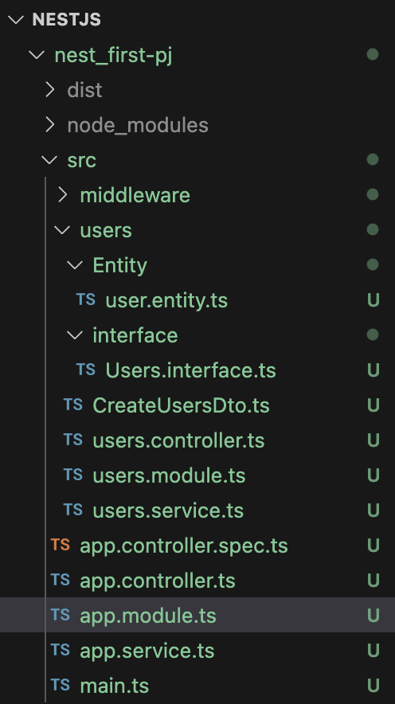
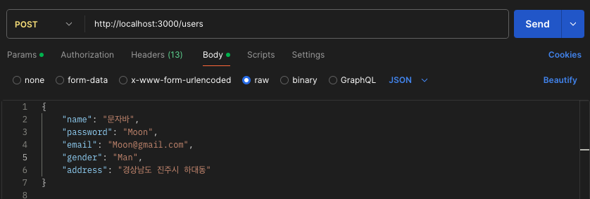
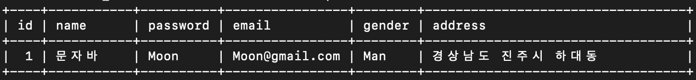
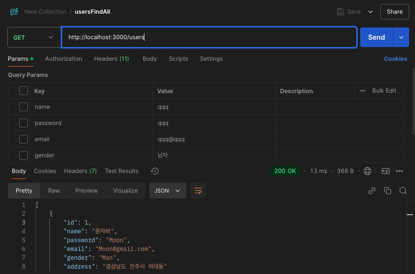
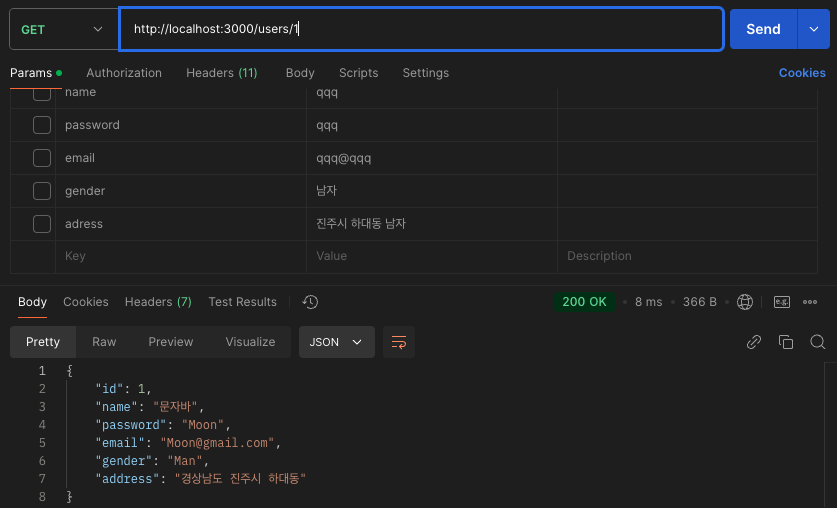
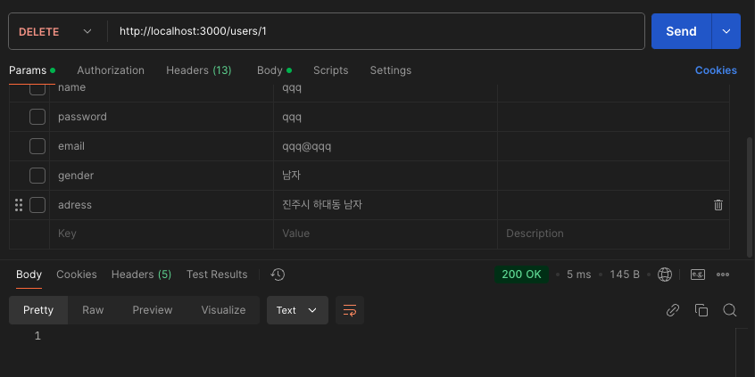
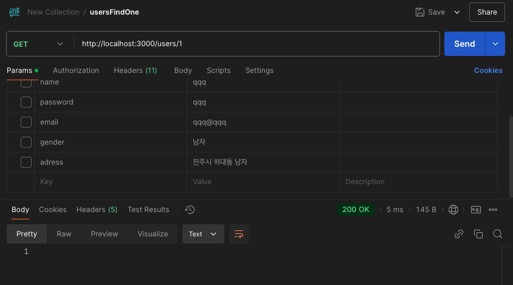

## TypeORM
TypeORM은 TypeScript와 JavaScript로 작성된 ORM(Object Relational Mapping) 라이브러리로, 데이터베이스와 애플리케이션 간의 상호작용 위해 사용된다.

### ORM (Object Relational Mapping)
객체(Object)와 데이터베이스 테이블(Table)을 매핑하여, 데이터베이스의 데이터를 객체로 다룰 수 있게 해주며
SQL 쿼리를 직접 작성하지 않고, 객체를 통해 데이터베이스 작업(CRUD)을 수행할 수 있다.

### Entity
데이터베이스 테이블에 매핑되는 클래스이다.
TypeORM 에서는 반드시 클래스를 사용해야 한다.

- Class : 
    - 런타임과 캄퍼일 타임 모두 존재하며, 실제 객체 생성 가능
    - 데이터 구조와 동작(메서드) 정의 및 구현 가능
    
- Interface : 
    - 컴파일 타임에만 존재하며, 런타임에는 제거된다.
    - 데이터 구조(속성과 타입)만 정의가능하고, 동작을 표현하는 메서드는 구현할 수 없다.
    - ORM 에서는 직접 사용할 수 없다.

### Repository:
데이터베이스 작업(CRUD)을 수행하는 인터페이스를 제공하며 각 엔터티에 대해 자동으로 생성된다.

### QueryBuilder:
복잡한 SQL 쿼리를 TypeORM에서 제공하는 메서드를 사용해 작성할 수 있다.

## TypeORM 설치 (MariaDB)
```npm install --save @nestjs/typeorm typeorm mariadb```

설치가 완료되면 app.Module에 TypeORM 모듈을 app.module.ts에 import한다.

```javascript
import { MiddlewareConsumer, Module, NestModule } from '@nestjs/common';
import { AppController } from './app.controller';
import { AppService } from './app.service';
import { UsersModule } from './users/users.module';
import { LoggerMiddleware } from './middleware/logger.middleware';
import { TypeOrmModule } from '@nestjs/typeorm';

@Module({
  imports: [
    UsersModule, // UsersModule 추가
    TypeOrmModule.forRoot({ // ORM 모듈
      type: 'mariadb', // 데이터베이스 타입 설정
      host: 'localhost',
      port: 3306,
      username: 'root', // 사용자 이름
      password: '', // 비밀번호
      database: 'test_NestJS', // 데이터베이스 이름
      entities: [__dirname + '/**/*.entity{.ts,.js}'], // 엔터티 경로
      synchronize: true, // 개발 중 자동 스키마 동기화 (운영 환경에서는 false)
    }),
  ],
  controllers: [AppController],
  providers: [AppService],
})
export class AppModule implements NestModule {
  configure(consumer: MiddlewareConsumer) {
    consumer.apply(LoggerMiddleware).forRoutes('users');
  }
}
```

app.module.ts에 import한뒤 Entity 클래스를 만들어준다.


```javascript
import { Column, Entity, PrimaryGeneratedColumn } from "typeorm";

@Entity()
export class User{
    @PrimaryGeneratedColumn()
    id : number;

    @Column()
    name: string;
    
    @Column()
    password: string;
    
    @Column()
    email: string;
    
    @Column()
    gender: string;
    
    @Column()
    address: string;
}
```

이제 users Entity에 대한 데이터베이스 작업을 수행하기 위해 TypeORM의 Repository를 모듈에서 사용할 수 있도록 users.module.ts에 import해주고 다른 모듈에서 사용할 수 있게 exports 해준다.

```javascript
import { Module } from '@nestjs/common';
import { UsersController } from './users.controller';
import { UsersService } from './users.service';
import { TypeOrmModule } from '@nestjs/typeorm';
import { Users } from './Entity/users.entity';

@Module({
    imports:[TypeOrmModule.forFeature([Users])],
    controllers : [UsersController],
    providers:  [UsersService]
})

export class UsersModule {
    
}
```

DB에 저장할 비즈니스 로직을 구현하기 위해 user.service.ts에 Users Entity를 의존성 주입을 하고 DB로직
메서들 작성해준다.

```javascript
import { Injectable } from '@nestjs/common';
import { InjectRepository } from '@nestjs/typeorm';
import { Users } from './Entity/users.entity';
import { Repository } from 'typeorm';


@Injectable() // Dependency injection
export class UsersService {
    constructor(
        @InjectRepository(Users)
        private usersRepository: Repository<Users>,
    )
    {}

    findAll(): Promise<Users[]>{
        return this.usersRepository.find();
    }

    findOne(id: number): Promise<Users>{
        return this.usersRepository.findOne({ where: { id } });
    }

    async create(users: Users): Promise<void>{
        await this.usersRepository.save(users);
    }

    async remove(id: number): Promise<void>{
        await this.usersRepository.delete(id);
    }

}

```

user.service.ts에 맞춰서 Controller도 작성해준다.

```javascript
import { Body, Controller, Delete, Get, Param, Post, Put } from '@nestjs/common';
import { CreateUserDto } from './CreateUsersDto';
import { UsersService } from './users.service';
import { Users } from './Entity/users.entity';

@Controller('users')
export class UsersController {
    constructor(private usersService: UsersService){

    }; // private는 선언과 동시에 이루어진다.

    @Get() //user
    findAll(): Promise<Users[]>{
        return this.usersService.findAll();
    }
    
    @Get(':id')
    findOne(@Param('id')id : number) : Promise<Users>{
        return this.usersService.findOne(id);
    }

    @Post()
    create(@Body() users: Users){
        return this.usersService.create(users);
    };

    @Delete(':id')
    remote(@Param('id')id: number){
        this.usersService.remove(id);
    }
}
```
___
### 유저 데이터 생성


___
### 생성된 유저 데이터 확인


___
### 전체 유저 확인


___
### Read Id User




