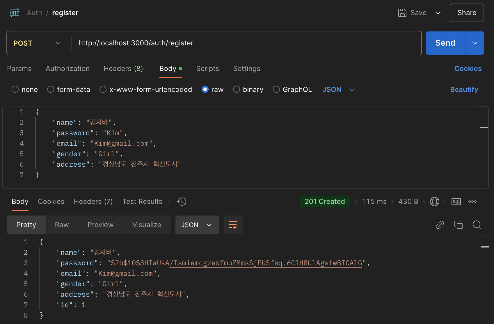
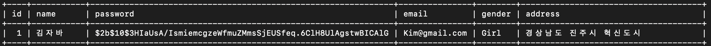
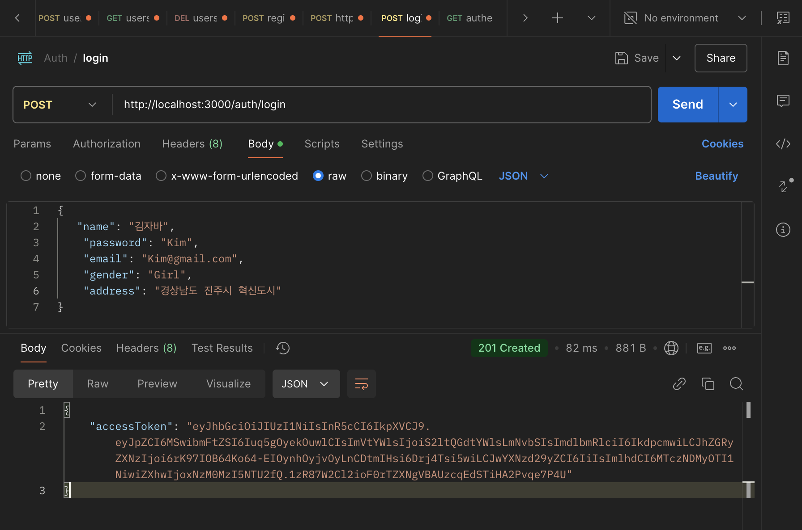
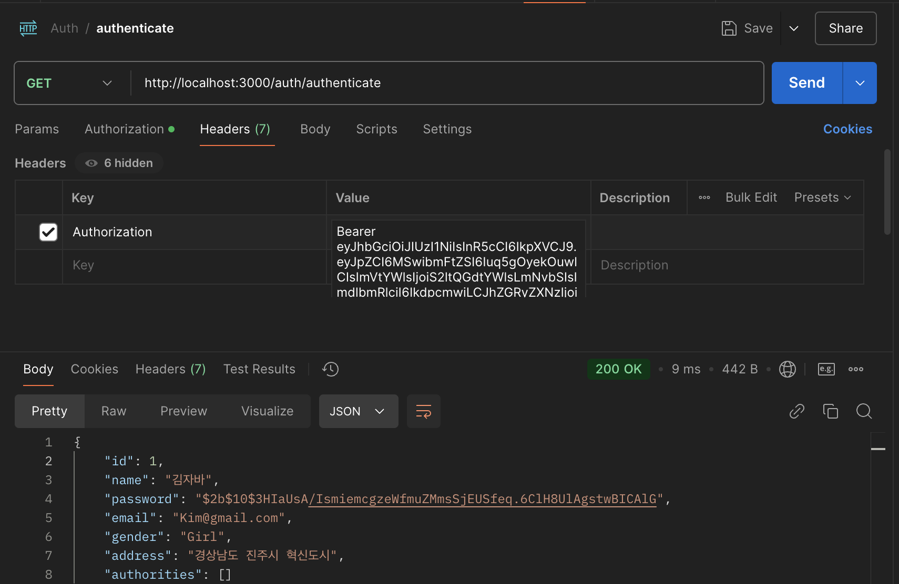
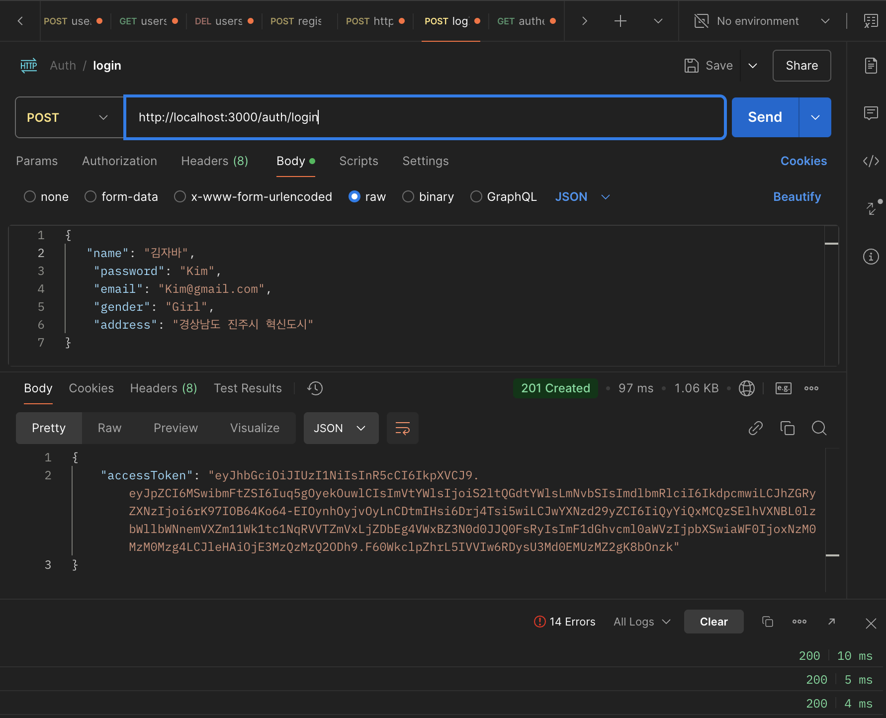
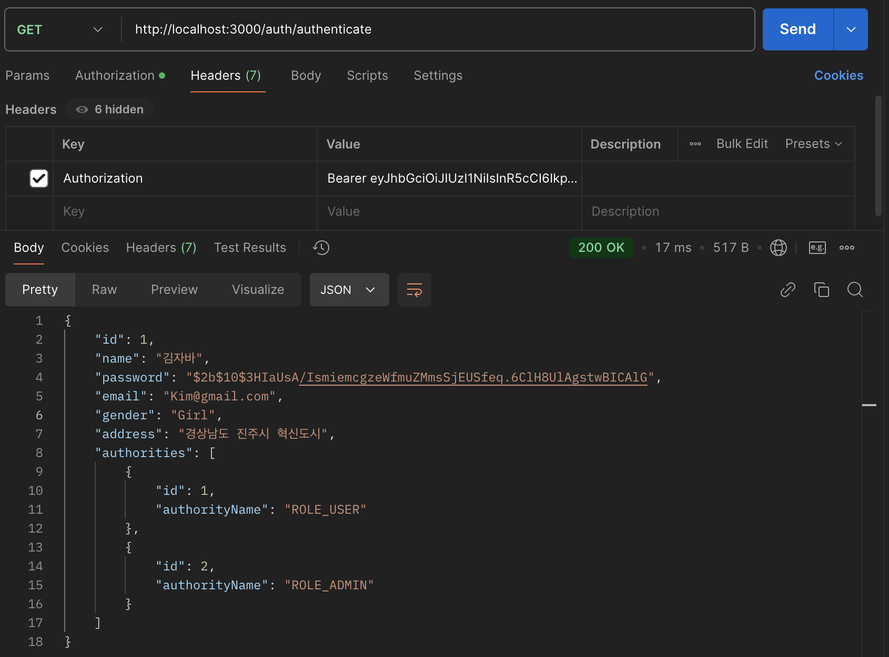
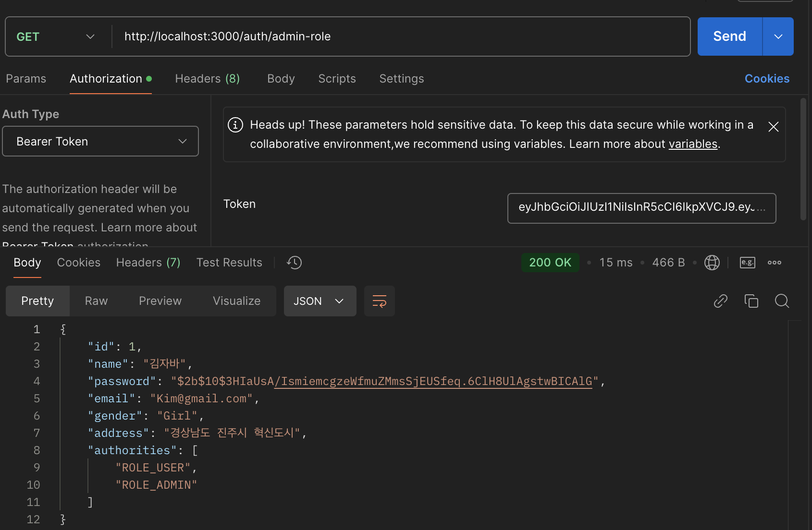
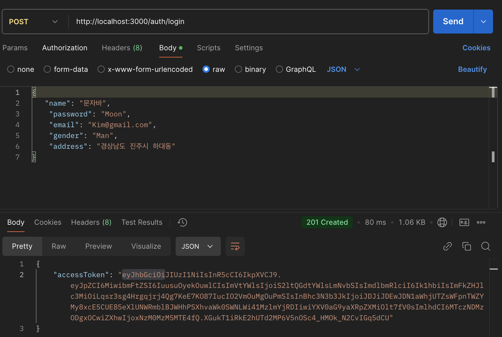
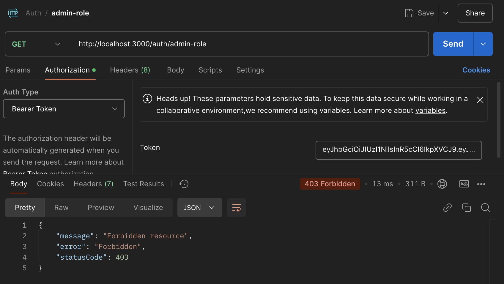

## JWT (Json Web Token)
JWT는 Json 객체를 사용하여 정보를 안전하고 간결하게 표현한 토큰이다.
주로 사용자 인증 및 정보 전달을 위해 사용되며 데이터를 토큰에 포함하며 state를 클라이언트에 저장한다. (Stateless Authentication)

### state
state(상태)란 사용자 인증 정보나 사용자와 서버 간이 세션 정보를 포함한 데이터를 서버 측에서 유지 관리하는 것을 의미한다.

- 사용자 인증 정보 : 
    - 사용자 로그인 여부
    - 로그인한 사용자 ID
    - 사용자 역할(Role)이나 권한(Lavel) 정보
    - 사용자에 대한 기타 정보 (프로필, 환경 설정)

- 세션 정보 : 
    - 사용자의 로그인 시간
    - 세션 만료 시간
    - 세션 ID
    - 사용자 요청 히스토리

### Session
Session 기반 인증은 사용자가 로그인하면 서버가 사용자의 인증 정보를 확인한 후 고유한 세션 ID를 생성하고, 이를 클라이언트에 반환한다. 
클라이언트는 서버에서 반환된 세션 ID를 쿠키에 저장하고, 이후 사용자의 요청마다 클라이언트는 이 세션 ID를 서버에 전송하고 서버는 요청 시 전달된 세션 ID를 확인한 후 
세션 저장소에서 조회하여 사용자 상태와 인증 정보를 확인한다.

이렇게 확인된 정보를 바탕으로 요청을 처리하며, 서버는 세션 저장소에 사용자의 상태를 유지한다. 이 방식은 사용자의 상태를 서버가 직접 관리하므로
로그아웃이나 세션 만료 시 서버에서 세션을 삭제하거나 무효화할 수 있지만 세션 정보를 서버에 저장하기 때문에 서버 부하가 증가할 수 있으며, 
분산 환경(여러 대의 서버가 클라이언트의 요청을 처리하는 환경)에서는 세션 동기화가 필요해 복잡도가 높아질 수 있다.

### JWT
JWT 기반 인증은 사용자가 처음 로그인할 때, 서버가 아이디와 비밀번호를 확인한 후 JWT를 생성해 클라이언트에 반환한다. 
반환된 JWT에는 사용자 정보와 만료 시간 등이 포함되며, 클라이언트는 JWT를 저장하고 이후 클라이언트가 서버로 요청을 보낼때 마다 서버로 JWT를 함께 전송한다. 
서버는 클라이언트의 요청을 받아 JWT의 서명을 검증하고 만료 시간 및 포함된 정보를 확인하여 처리하기 때문에 별도의 세션 데이터나 상태를 서버에 저장하지 않는다.

서버는 JWT의 서명(Signature)을 확인해 토큰이 위변조되지 않았는지 검증하고, 유효한 경우 JWT의 Payload에 포함된 정보를 바탕으로 요청을 처리한다. 
이러한 방식으로 session 방식처럼 서버의 상태(state)를 유지하지 않아도 되므로, **Stateless(무상태)**한 인증을 가능하게 하며, 특히 분산 환경이나 확장성 높은 시스템에서 효과적으로 사용된다.

### 클라이언트가 JWT를 저장시키는 위치 
    - 비공개 변수 : 
        브라우저가 새로고침될 때마다 유지가 되지 않기 때문에 사용자는 새로고침 할 때마다 재접속을 해야하는 불편함을 가진다.(자주 사용하진 않음)
    
    - 로컬 스토리지 : 
        브라우저가 새로고침 되더라도 정보들이 유지되기 때문에 사용자 편의성이 높지만 JS코드를 통해 접근이 가능하기 때문에 XSS 공격에는 취약하고 CSRF 공격에는 안전하다. (일반적으로 대부분 사용함.)
    
    -  세션 스토리지 : 
        현재 떠 있는 텝에서만 유지되는 특징을 가진다. 새로 고침할 때는 사라지지 않지만, 탭을 닫고 다시 열 때는 데이터가 사라진다. (로컬스토리지에 비해 제한적임.)
    
    - 쿠키 : 
        로컬 스토리지와 비슷하게 JS로 접근이 가능하기 때문에 서버측에서 HTTP Only, Secure, Samesite 등 옵션을 걸어 줘야 한다.
        (모든 요청에 쿠키가 함께 전송되기 때문에 성능 저하의 원인이 될 수 있어 MDN 공식 문서에서 쿠키에 저장하는 방식보단 로컬 스토리지에 저장하는 형식이 권장됨.)

#### 회원가입

#### 회원가입 유저 데이터 

#### 로그인 - JWT 발급

#### 로그인한 유저의 JWT값 조회 

### 권한
권한 추가를 위해서 UserAuthority 테이블을 만든다.

MariaDB [test_NestJS]> INSERT INTO `test_NestJS`.`UsersAuthority` (users_id, authority_name) VALUES (1, 'ROLE_USER');

MariaDB [test_NestJS]> INSERT INTO `test_NestJS`.`UsersAuthority` (users_id, authority_name) VALUES (1, 'ROLE_ADMIN');

MariaDB [test_NestJS]> INSERT INTO `test_NestJS`.`UsersAuthority` (users_id, authority_name) VALUES (2, 'ROLE_USER');

권한 추가 후 다시 로그인

Token 값으로 로그인한 유저의 권한 확인

admin 권한을 가지고 있는 유저 확인

admin 권한이 아닌 유저 로그인

admin 권한이 아닌 유저로 admin 권한 요청 - 403 에러 (클라이언트가 요청한 리소스에 엑세스할 권한이 없음)
