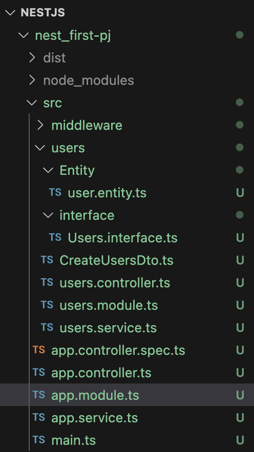

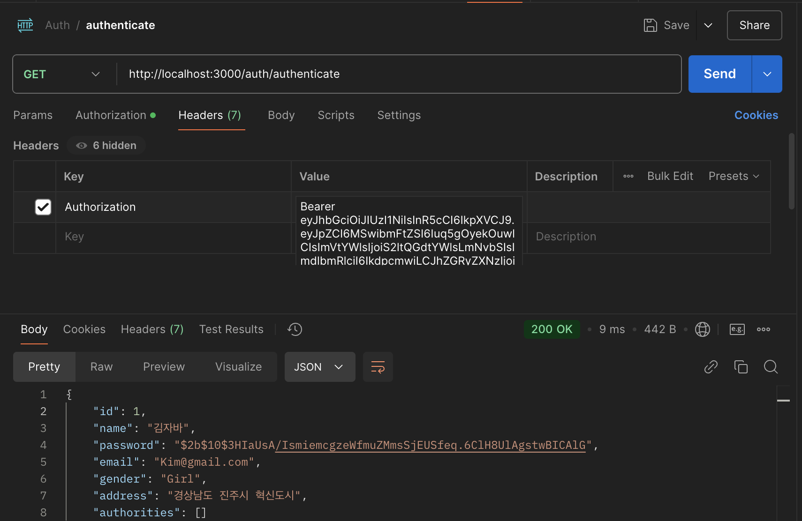

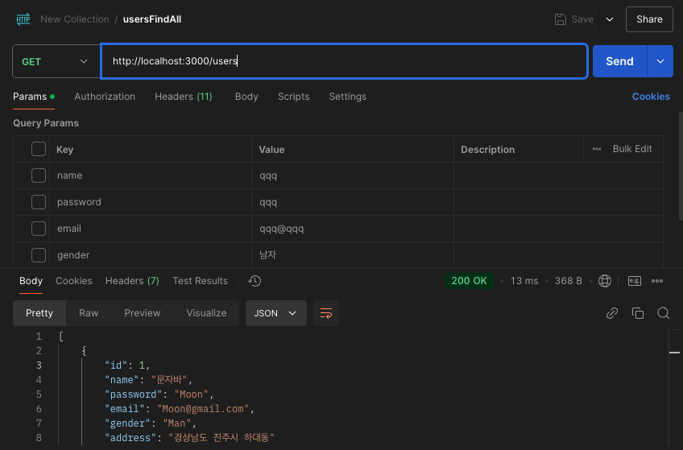

MariaDB [test_NestJS]> INSERT INTO `test_NestJS`.`UsersAuthority` (users_id, authority_name) VALUES (1, 'ROLE_USER');

MariaDB [test_NestJS]> INSERT INTO `test_NestJS`.`UsersAuthority` (users_id, authority_name) VALUES (1, 'ROLE_ADMIN');

MariaDB [test_NestJS]> INSERT INTO `test_NestJS`.`UsersAuthority` (users_id, authority_name) VALUES (2, 'ROLE_USER');

권한 추가 로그인
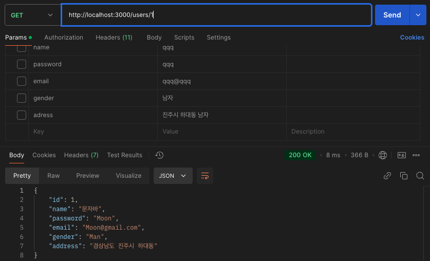

로그인 후 다시 인증 요청
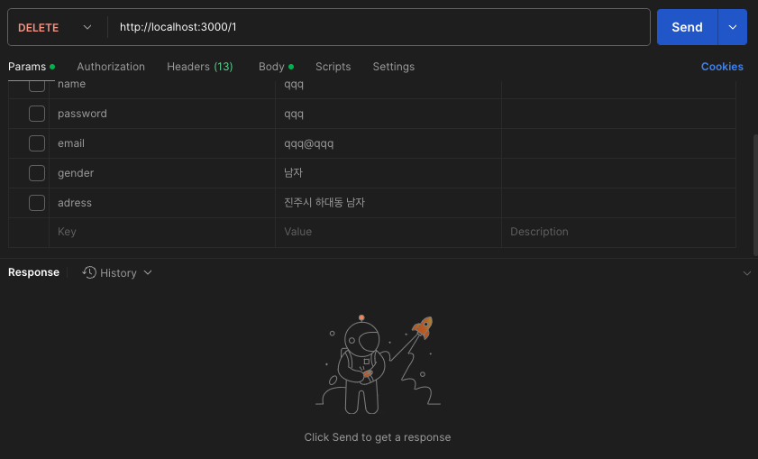

권한만 나오게 수정 

다시 로그인
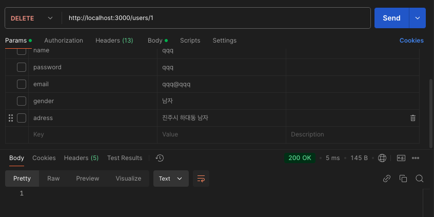

권한 요청
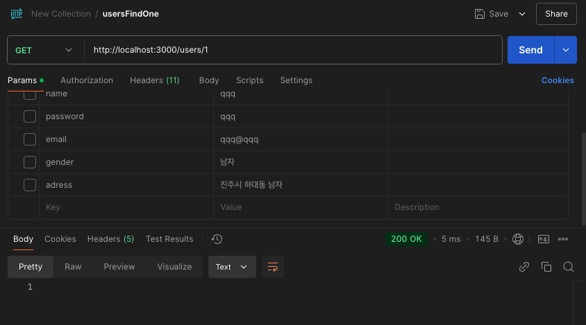

어드민 권한에 따른 요청
다시 로그인
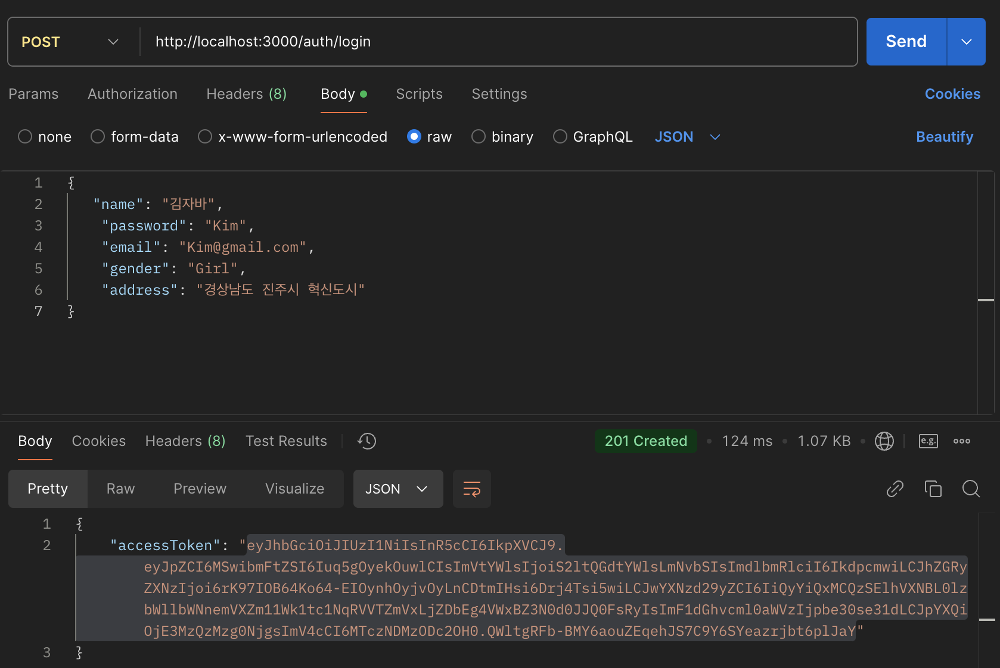

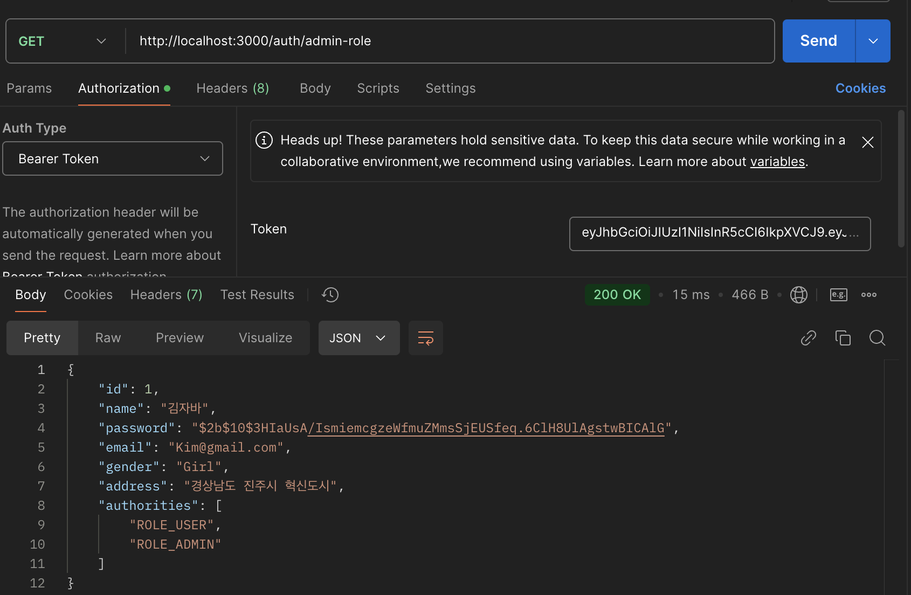

어드민 권한이 아닌 다른 요청
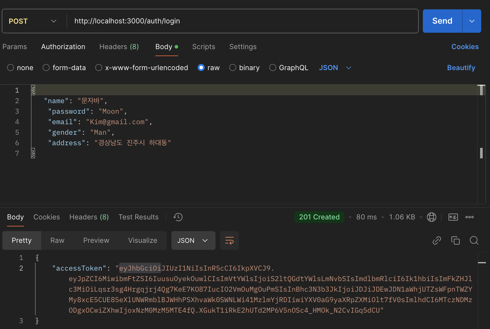

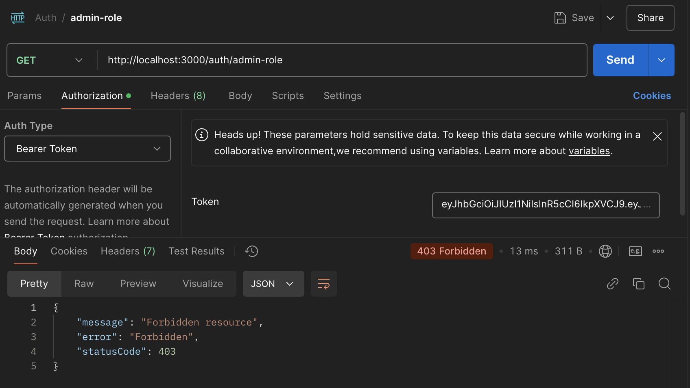