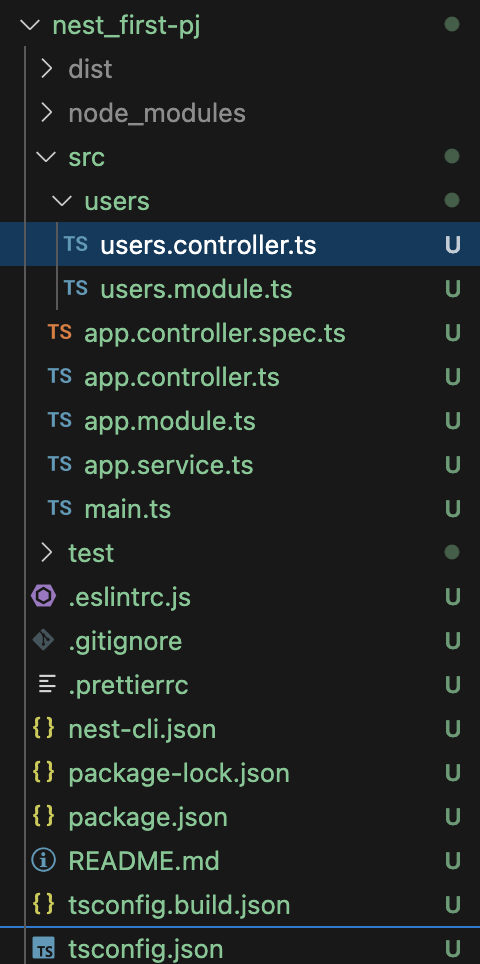
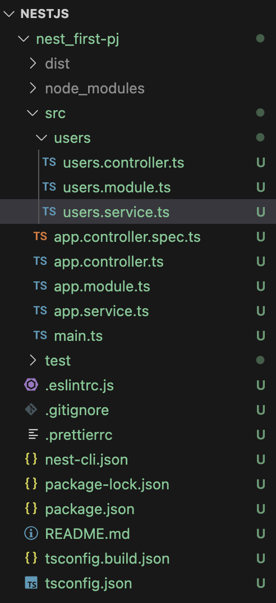

## Generator
Nest는 소스코드를 자동으로 생성해주는 Generator 기능이 있다. 
Generator 기능으로 Module, Controller, Service등을 생성할 수 있다.

### module 자동 생성
```nest -g module users``` 명령어를 사용하여 users module을 생성한다.
```CREATE users/users.module.ts (82 bytes)``` 와 같이 결과가 나오면 

users라는 모듈이 생기게 된다.


모든 모듈은 Root Module에서 관리하기 때문에 Root Moudule인 app.module.ts에 user.module.ts를 import 해주면 어플리케이션에서 전역으로 user.module.ts를 사용할 수 있게 된다.

```javascript
import { Module } from '@nestjs/common';
import { AppController } from './app.controller';
import { AppService } from './app.service';
import { UsersModule } from './users/users.module';

@Module({
  imports: [UsersModule],
  controllers: [AppController],
  providers: [AppService],
})
export class AppModule {}
```

### controller 자동 생성
```nest g controller users``` 명령어를 사용하여 users controller를 생성한다.
```CREATE users/users.controller.spec.ts (485 bytes)```
```CREATE users/users.controller.ts (99 bytes)``` 와 같이 결과가 나오면 

users라는 컨트롤러가 생기게 된다.



```javascript
import { Controller } from '@nestjs/common';

@Controller('users')
export class UsersController {}
```

controller는 Module에서 관리하기 때문에 users.module.ts에 import 해준다.
```javascript
import { Module } from '@nestjs/common';
import { UsersController } from './users.controller';

@Module({controllers : [UsersController]})

export class UsersModule {
    
}
```

### service 자동 생성

```nest g service users``` 명령어를 사용하여 users service를 생성한다.
```CREATE users/users.service.spec.ts (453 bytes)``` 
```CREATE users/users.service.ts (89 bytes)``` 와 같이 결과가 나오면 

users라는 service가 생기게 된다.



```javascript
import { Injectable } from '@nestjs/common';

@Injectable() // Dependency injection
export class UsersService {}

```

service도 Module에서 관리하기 때문에 users.module.ts에 import 해준다.
```javascript
import { Module } from '@nestjs/common';
import { UsersController } from './users.controller';
import { UsersService } from './users.service';

@Module({
    controllers : [UsersController],
    providers:  [UsersService]
})

export class UsersModule {
    
}
```

### 코드를 직접 작성하여도 되지만 Generator를 사용하면 더욱 편리하게 프로젝트를 진행할 수 있다.


